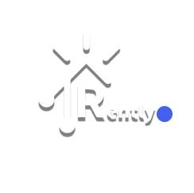

*Discover, Connect, Rent*

Rently is a comprehensive property rental platform that connects landlords and tenants directly, eliminating the need for intermediaries. With Rently, landlords can showcase their properties, and tenants can easily find and book their ideal rental homes. This project is designed to streamline the property rental process and provide a seamless user experience.

## Features

- User registration and authentication
- Property listing creation and management
- Advanced property search and filtering
- Booking system with saved properties functionality
- Review and rating system for properties
- User profile management and dashboard
- Responsive design for various devices

## Getting Started

1. Clone the repository: `git clone https://github.com/your-username/rently.git`
2. Install project dependencies: `pip install -r requirements.txt`
3. Set up your MySQL database and update `config.py` with the database URL
4. Initialize the database: `flask db upgrade`
5. Run the application: `flask run`

## Screenshots

## Technologies Used

- Python with Flask web framework
- MySQL database
- Flask-WTF for forms
- Flask-Login for user sessions

## Contributing
Favour Ocheja <favourocheja@gmail.com>

Samuel John <samueljohn3999@gmail.com>

We welcome contributions! If you'd like to contribute to Rently, please follow these steps:

1. Fork the repository
2. Create a new branch for your feature: `git checkout -b feature-name`
3. Make your changes and commit: `git commit -m "Add new feature"`
4. Push to your forked repository: `git push origin feature-name`
5. Create a pull request to the main repository

## License

This project is licensed under the MIT License - see the [LICENSE](/LICENSE) file for details.

## Contact

For inquiries, feedback, or support, please contact us via our email address

---
